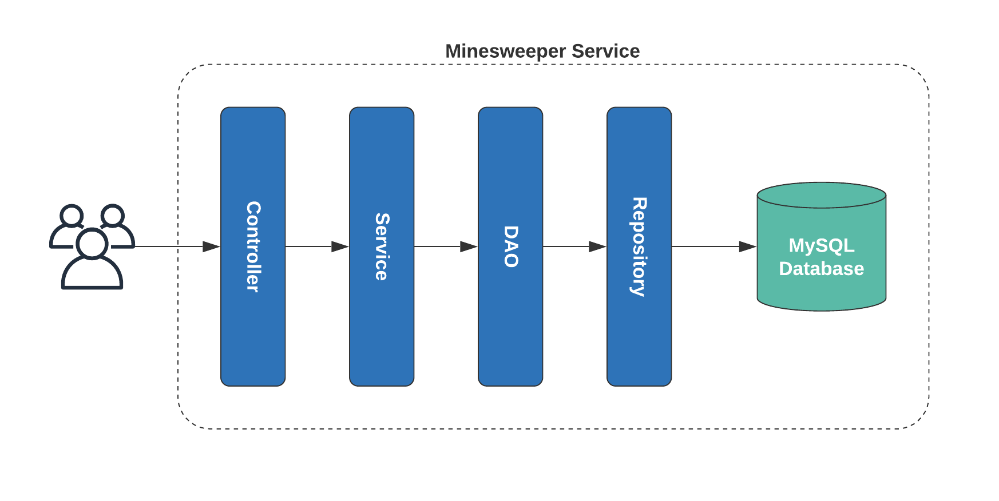

# Minesweeper - REST API Service
This Microservice handles the operations needed to play [Minesweeper game](https://en.wikipedia.org/wiki/Minesweeper_(video_game)).

## Technologies & Frameworks
The stack used for this project includes:
* Java 8
* Spring Boot 2.3
* Maven
* JPA
* MySQL
* SLF4J (for logging)
* Flyway (to handle DB model and migrations)
* Orika (for Entities and Beans mapping)
* TestNG (for Unit Testing)
* Swagger (to navigate and test the available API's)

## Build & Run
To build the project locally, execute: 
`mvn clean install`

To run the project, execute: 
`mvn spring-boot:run`

## Basic Architecture
The layers included are as follow:

* **Controller:** This layer is in charge of receiving incoming requests from clients and pass them to the services, and returning the responses.
* **Service:** Layer that contains all the business logic and perform functional processes, communicating with other services or DAO if needed.
* **DAO:** Specific layer for abstraction, that handles the mapping between Entities and Beans, removing that responsibility from the service, and communicates with the Repositories.
* **Repository:** Handles communication between DAOs and the DB.

## Postman
A [Postman collection](MineSweeper.postman_collection.json) has been included as part of the project, with some sample request to test the existing APIs.

## Swagger
The project includes Swagger and SwaggerUI plugin, to navigate through the available APIs, review their specifications, and performan some basic calls. This can be achieved by accessing `/swagger-ui.html` in the application base path, for example: 
`http://localhost:8080/swagger-ui.html`

